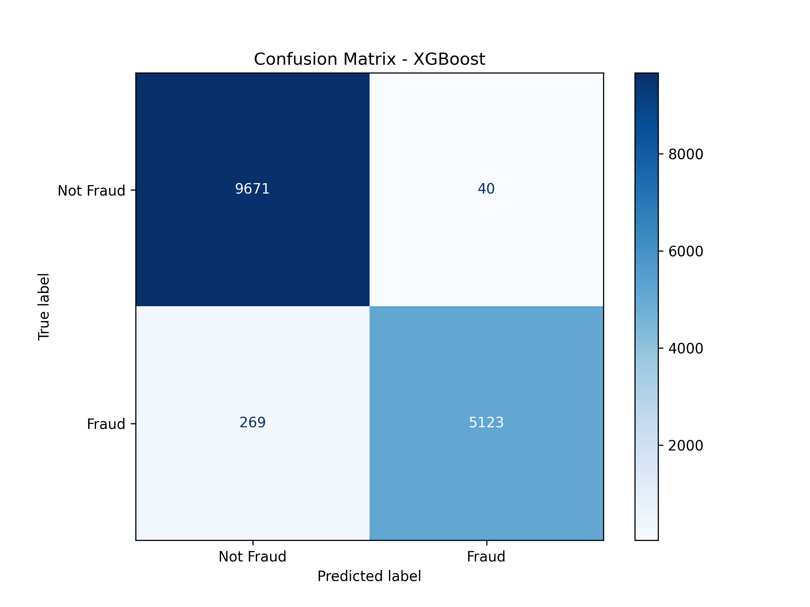
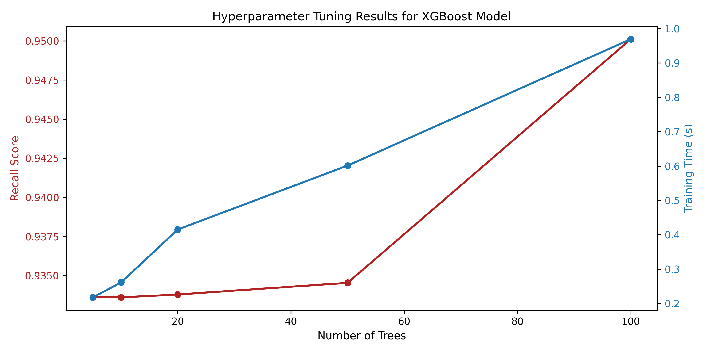

<h1 align="center"> Hybrid Network Intrusion Detection System </h1>
<h5 align="center"> Project Machine Learning - HUST (2025.2) <h5>

<!-- TABLE OF CONTENTS -->
<h2 id="table-of-contents"> :book: Table of Contents</h2>

  
Table of Contents

  <ol>
    <li><a href="#overview"> ➤ Overview</a></li>
    <li><a href="#project-files-description"> ➤ Project Files Description</a></li>
    <li><a href="#requirements"> ➤ Requirements </a></li>
    <li><a href="#execution-instructions"> ➤ Execution Instructions  </a></li>
    <li><a href="#experimental-results"> ➤ Experimental Results  </a></li>
    <li><a href="#contributors"> ➤ Contributors </a></li>
  </ol>

<!-- OVERVIEW -->
<h2 id="overview">Overview</h2>

 
  This project implements a Hybrid NIDS framework designed to handle modern network threats. By leveraging the NSL-KDD dataset, the system employs a two-tier approach:

<ul>
  <li><b>Supervised Learning</b> : High-accuracy classification of known attack signatures (e.g., Neptune, Smurf).</li>
 <li><b>Unsupervised Learning</b> : Detection of novel "Zero-day" anomalies based on statistical deviations and distance thresholds.</li>
</ul>

<!-- PROJECT FILES DESCRIPTION -->
<h2 id="project-files-description">Project Files Description</h2>

<ul>
  <li><b>xử lý dữ liệu.py</b> - Data preprocessing: converts raw CSV datasets into optimized '.npy' arrays.</li>
  <li><b>BaoKmean.py</b> - Trains the K-Means unsupervised model and calculates the anomaly threshold.</li>
  <li><b>RandomForest.py</b> -   
Implementation and training of the Random Forest supervised classifier.</li>
  <li><b>XG_Boost.py</b> - XGBoost classifier script including hyperparameter tuning logic.</li>
  <li><b>SVM.py</b> - Support Vector Machine (SVM) implementation for supervised detection.</li>
  <li><b>ISFR.py</b> - Isolation Forest algorithm for unsupervised anomaly detection.</li>
</ul>

<h3>Integration files</h3>
<ul>
  <li><b>main_integration_*.py</b> - Entry points for the hybrid system (e.g., 'RF-Kmeans', 'XGB-ISFR').</li>
</ul>

<h3>Artifacts files</h3>
<ul>
  <li><b>*.pkl</b> - Saved pre-trained models (e.g., 'supervised_rf_model.pkl') for instant deployment.</li>
  <li><b>*.npy</b> - SPre-processed numerical data arrays for high-speed loading.</li>
  <li><b>*.csv</b> - Original NSL-KDD dataset files used for training and zero-day testing.</li>
</ul>

<!-- REQUIREMENTS -->
<h2 id="requirements">Requirements</h2>

Ensure you have Python installed, then run the following command to install the necessary libraries:

<pre><code>pip install numpy pandas scikit-learn joblib xgboost scipy</code></pre>

<!-- EXECUTION INSTRUCTIONS -->
<h2 id="execution-instructions">Execution Instructions</h2>

  
Follow the steps below to prepare the data, train models, and deploy the hybrid system:

<h3>Step 1: Data Preprocessing</h3>
  
The first step is to process the raw NSL-KDD datasets. This script converts <code>.csv</code> files into optimized <code>.npy</code> arrays for faster loading and training:

  <pre><code>python "xử lý dữ liệu.py"</code></pre>

  <h3>Step 2: Individual Component Training (Optional)</h3>
  
If you wish to retrain individual models or update the <code>.pkl</code> artifacts, execute the specific algorithm scripts. For example, to train the K-Means anomaly detector and recalculate the threshold:
  

  <pre><code>python BaoKmean.py</code></pre>
  
<i>Note: This will generate or update files like <code>unsupervised_kmeans_model.pkl</code> in your working directory.</i>

  <h3>Step 3: Running the Hybrid System</h3>
  
The core of the project lies in its hybrid integration. You can choose from several predefined integration scenarios depending on the models you wish to combine:

<ul>

 <li><b>XGBoost + Isolation Forest (Recommended):</b></li>
    <pre><code>python main_integration_XGB-ISFR.py</code></pre>
    
   <li><b>Random Forest + K-Means:</b></li>
    <pre><code>python main_integration_RF-Kmeans.py</code></pre>
    
   <li><b>SVM + Isolation Forest:</b></li>
    <pre><code>python main_integration_SVM-ISFR.py</code></pre>
  </ul>
  
  

    <i>Check the console output for real-time detection results and performance metrics (Accuracy, F1-Score, etc.).</i>
  

<!-- EXPERIMENTAL RESULTS -->
<h2 id="experimental-results">Experimental Results</h2>

The system's performance was evaluated using the NSL-KDD test set. Below are the visual results for the XGBoost component, which demonstrated high accuracy in identifying various attack types:

<table border="0">
    <tr>
      <td>
        
<b>Confusion Matrix</b>

        
      </td>
      <td>
        
<b>Hyperparameter Tuning</b>

        
      </td>
    </tr>
  </table>
  

<i>The hybrid integration significantly reduces False Positives by cross-verifying supervised classifications with unsupervised anomaly scores.</i>

<!-- CONTRIBUTORS -->
<h2 id="contributors">Contributors</h2>

This project was developed by a team of students:

<table border="1" style="width: 60%; text-align: center; border-collapse: collapse;">
    <thead>
      <tr style="background-color: #f2f2f2;">
        <th>Full Name</th>
        <th>Student ID</th>
      </tr>
    </thead>
    <tbody>
      <tr>
        <td>Thân Hoàng Bách</td>
        <td>202416778</td>
      </tr>
      <tr>
        <td>Nguyễn Bùi Gia Bảo</td>
        <td>202416779</td>
      </tr>
      <tr>
        <td>Nguyễn Minh Hằng</td>
        <td>202416792</td>
      </tr>
      <tr>
        <td>Mai Thị Diệu Linh</td>
        <td>202416807</td>
      </tr>
      <tr>
        <td>Nguyễn Anh Quân</td>
        <td>202416821</td>
      </tr>
    </tbody>
  </table>

